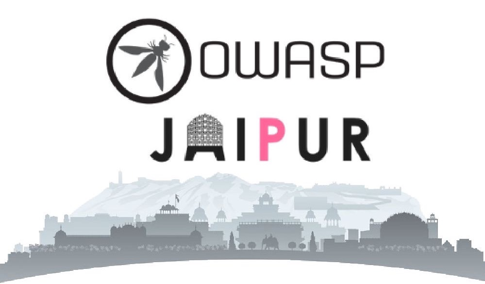

---

layout: col-sidebar
title: OWASP Jaipur
tags: jpr
level: 0
region: Asia
meetup-group: OWASP-Jaipur-Meetup-Group
country: India
postal-code: 302015

---
<!--   -->

<b>Welcome to the OWASP Jaipur chapter homepage. We conduct regular meetups to discuss, learn and implement our skills in the field of web & app security. OWASP Jaipur's meetings are FREE & OPEN to everyone who's interested in the information & cyber security domain! </b>

## Become a Speaker 
Would you like to speak on the upcoming OWASP Jaipur Webinar? [Contact Us](mailto:priyadarshan.vijay@owasp.org)

**Email Format :**

- Speaker name
- Job Role
- Company / Organization
- Country
- Email ID
- Contact Number
- Speaker Profile
- Presentation Details
    - Name / Title of the Presentation
    - Abstract of the presentation
    - Presentation time required
    
[Speaker Agreement](https://owasp.org/www-policy/)

## Upcoming Events



To know more about our upcoming events, follow us on our social handles.

**OWASP Jaipur's Webinar: Bug Bounty & Social Engineering**

**When**: Oct 2, 2020 -> 11 AM (IST)

**Description**: The talks by **Mr. Rohit Gautam** & **Ms. Shifa Cyclewala** will be full of free & exclusive tricks about cybersecurity & bug bounties. Kindly set a reminder for the event to make sure that you don't miss it.

## Supporter Opportunities 
For more information on how to support the OWASP Jaipur chapter in organising free and open security meets at your company/institution, contact one of our chapter leaders: 
[Prerit Pathak](mailto:prerit.pathak@owasp.org) 
[Priyadarshan Vijay](mailto:priyadarshan.vijay@owasp.org)

<h2>Code of Conduct</h2>
We care deeply about inclusivity and diversity in order to make OWASP Jaipur a convivial and welcoming community for everyone. If you have any feedback or would like to speak t(o us, please contact one of our chapter leaders. Your feedback is of utmost importance to us & is highly appreciated. You can find out more about our policies [here](https://owasp.org/www-policy/).

